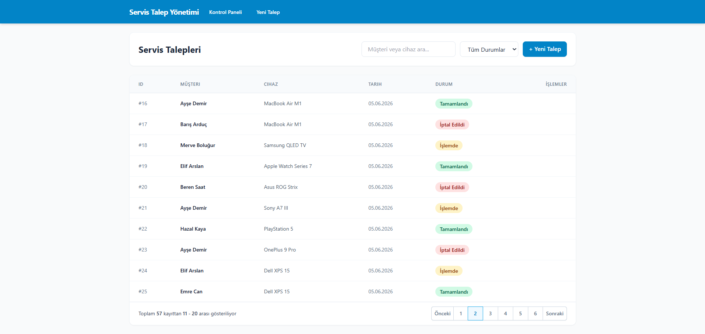
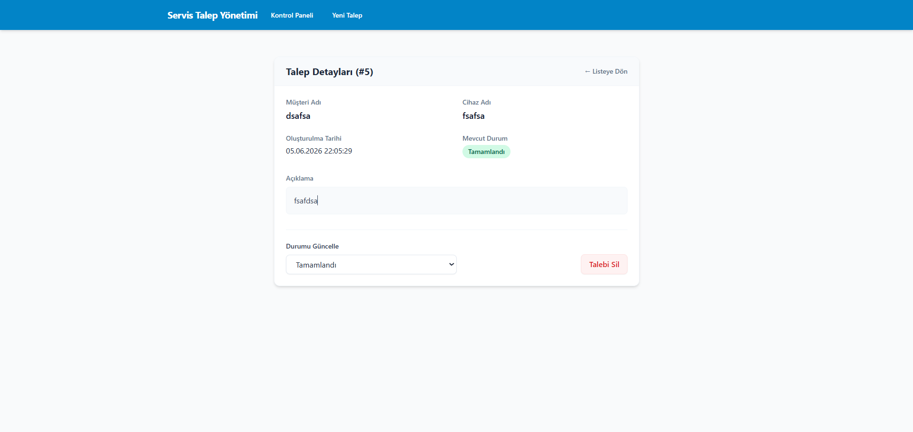
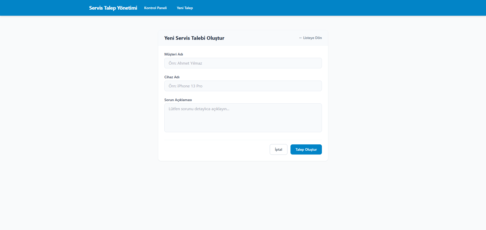

# Service Request Management System

### Home Page



### Request Details



### Create Request




## Project Overview
This is a Full-Stack technical assignment project designed for managing and tracking technical service requests. It consists of a .NET 8 Web API backend and a React/Vite frontend. The repository is configured to demonstrate solid software engineering principles, clean code practices, and modern architectural patterns.

## Technical Architecture & Design Patterns
- **N-Tier Architecture**: The solution is rigorously separated into logical layers (Entities, DataAccess, Business, Core, WebAPI) to ensure separation of concerns.
- **Repository Pattern**: Abstracted database operations using generic repositories (`IEntityRepository<T>`) to decouple data access logic from business logic.
- **DTO (Data Transfer Object) Pattern**: Utilized to ensure secure and optimized data transfer between the client and the API (e.g., `ServiceRequestCreateDto`).
- **Dependency Injection**: ASP.NET Core's built-in IoC container is leveraged to manage the lifecycles of repositories and services.

## Technologies & Tools Used
### Backend
- **.NET 8 & ASP.NET Core Web API**: Core framework for building RESTful services.
- **Entity Framework Core (EF Core)**: ORM for seamless database operations.
- **SQLite**: Lightweight database. The database is generated automatically via EF Core Code-First migrations.
- **Async/Await**: The asynchronous programming model is used throughout controllers, business services, and data access layers for non-blocking execution.
- **FluentValidation**: Employed for robust, rule-based input validation on incoming DTOs before they hit the core business logic.
- **Swagger**: Integrated for interactive API documentation and endpoint testing.

### Frontend
- **React 18 & Vite**: Fast development environment and component-based UI.
- **TypeScript**: Ensures type safety across the client application.
- **Tailwind CSS**: Utility-first CSS framework used for building a clean, responsive, and professional interface.
- **Axios & React Router**: Used for HTTP communication and client-side routing.

### Testing
- **xUnit & Moq**: The business logic is validated using unit tests. Mocking is utilized via Moq to isolate the service layer from the database. Specifically, `ServiceRequestManager` is tested to ensure:
  - The `Status` property is automatically assigned to `"New"` upon request creation.
  - The `CreatedDate` is dynamically generated at the exact time of creation.
  - Status update operations execute reliably and reflect expected changes.

## Bonus Features
- **Search Functionality**: Real-time filtering of service requests by Customer Name or Device Name.
- **Status Filtering**: The ability to filter the data grid based on specific request statuses.
- **Localized Dynamic UI Mappings**: The frontend securely handles standard English status payloads from the API while dynamically presenting localized Turkish equivalents with corresponding color indicators to the user.

## Project Structure
- **Entities**: Contains core database entity models and DTOs.
- **DataAccess**: Contains the EF Core `DbContext`, Code-First migrations, and concrete repository implementations.
- **Core**: Contains generic repository definitions, standard unified return types (`IResult`, `IDataResult`), and cross-cutting concerns (e.g., `ValidationTool`).
- **Business**: Houses the business logic layer, `FluentValidation` rules, and service managers.
- **Business.Tests**: The xUnit test project containing mock-based unit tests for the Business layer.
- **WebAPI**: ASP.NET Core Web API controllers acting as the presentation layer.
- **frontend**: The React/Vite single-page application.

## Getting Started

### 1. Backend Execution
1. Navigate to the project root directory.
2. Apply database migrations to generate the SQLite database locally:
   ```bash
   dotnet ef database update --project DataAccess/DataAccess.csproj --startup-project WebAPI/WebAPI.csproj
   ```
3. Run the API:
   ```bash
   cd WebAPI
   dotnet run
   ```
   The API will start locally. Access the Swagger UI for endpoint documentation at `http://localhost:<port>/swagger` (e.g., `http://localhost:5000/swagger`).

### 2. Frontend Execution
1. Open a new terminal and navigate to the frontend directory:
   ```bash
   cd frontend
   ```
2. Install dependencies and start the Vite dev server:
   ```bash
   npm install
   npm run dev
   ```

### 3. Running Unit Tests
To execute the automated unit tests covering the business layer logic:
```bash
cd Business.Tests
dotnet test
```
